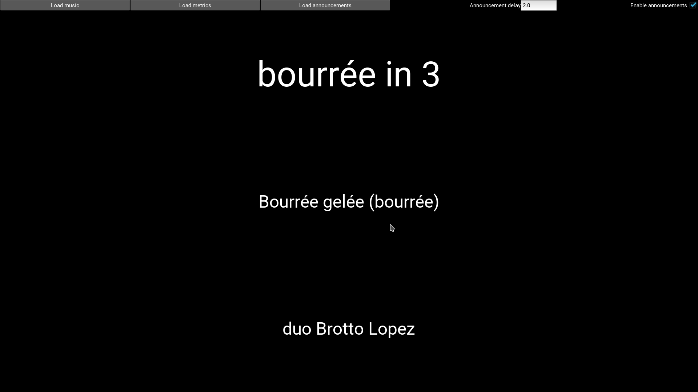
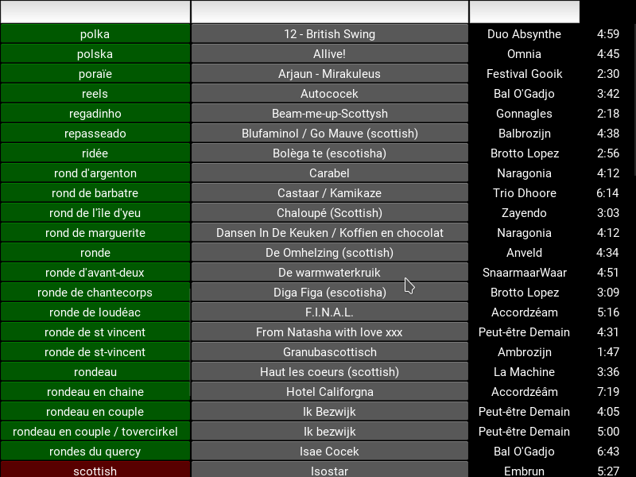

# playlist-generator
A tool to create ball folk playlist from tagged mp3/flac music

# Install Windows
(Not yet working)

## Prerequisites
Install Python

### Kivi
Based on https://kivy.org/docs/installation/installation-windows.html#install-win-dist

On a commandline:
```
python -m pip install --upgrade pip wheel setuptools
python -m pip install docutils pygments pypiwin32 kivy.deps.sdl2 kivy.deps.glew 
python -m pip install kivy
```
### VLC
Get it at https://www.videolan.org/vlc/download-windows.html

# Install Ubuntu 16.04
Install instructions for Ubuntu 16.04. 
These instructions are not tested on any other platform.
There should be no OS dependend prerequisites however, so if you managed to install it on an other platform, feel free to add the info.

## Prerequisites
Taglib, Mutagen, PyDub and Kivy

```
sudo apt install git
sudo apt install python3-pip
sudo apt install python3-taglib python3-mutagen ffmpeg python3-numpy libvlc-dev vlc python3-scipy python3-matplotlib aubio-tools libaubio-dev libaubio-doc
sudo pip3 install pydub
sudo pip3 install aubio
sudo add-apt-repository ppa:kivy-team/kivy
sudo apt-get update
sudo apt-get install python3-kivy
```


# Tools
There are several tools to create playlists

* danceAudioTagger.py : Prepends the annoucement of the type of the dance to the songs.
* staticPlaylistGenerator.py : Generates a m3u playlist according to some metrics.

## danceAudioTagger.py
### Usage 
```
danceAudioTagger.py [music/path] [genre/path] [output/path]
```
* music/path : The directory the songs can be found. The complete underlying tree will be traversed
* genre/path : The directory the announcements of the dance types can be found
* output/path : The directory the tagged songs will be exported to

### Remarks
If no corresponding announcement is found for a genre, the file is not exported.

## staticPlaylistGenerator.py
### Usage 
```
staticPlaylistGenerator.py  [music/path] [playlist/metrics/path] [output/filename] [duration (min)]
```

* music/path : The directory the songs can be found. The complete underlying tree will be traversed
* playlist/metrics/path : The file containing the metrics for the playlist
* output/filename : The filename of the playlist
* duration (min) : The duration of the playlist. The playlist will be at least this long, and finish the latest song. So it will be slightly longer.

### Metrics
The metrics file is a file containing the relative occurence of a dance in the playlist.
The syntax is ```[dance] = [occurence]```.

Example:
```
scottish = 5
wals = 2
mazurka = 3
```

This will generate a playlist with a relative occurence of 50% scottishes, 20% walzes and 30% mazurkas.
To keep the example simple evertyhing added up to 10.
But the list will be normalized by the program, so you don't need to keep the total into account.


### Remarks
* Every song will be used only once.
* There will be no two times the same dance after eachother.
* Don't make playlists longer than the music you have, or the program will keep on trying. There is no check on this yet.
* If you don't have enough songs of a specific dance to fulfil your occurence creterium for the length of your playlist, it will occure less. If the discrepancy is large, this will reduce the performance somewhat, but don't cause any other problems.

## playPlaylist.py
This program will continuously generate songs that fullfil the given metrics. 
It will only play a song once and will not play to dances of the same type after eachother.



### Usage
```
playPlaylist.py [path/to/music/] [path/to/playlist/metrics] [enable announcement 0/1] [path/to/genres/] <announcement delay (s)> 
```

* path/to/music/ : The directory the songs can be found. The complete underlying tree will be traversed
* path/to/playlist/metrics : The file containing the metrics for the playlist
* enable announcement 0/1 : Enable or disable the announcements
* path/to/genres/ : (needed if the announcements are enabled) The directory in which the announcements for the dances can be found.
* announcement delay (s) : The delay in between the two announcements in seconds (can be floating point)


### Remarks
See [staticPlaylistGenerator.py](#markdown-header-metrics) for the explanation about the metrics file.

## player.py
This program will generate a list of the different dances and allow you to filter on them.



### Usage
```
player.py [path/to/music/]
```
* path/to/music/ : The directory the songs can be found. The complete underlying tree will be traversed

# Development setup
## Windows
### Prerequisits

- [VLC](https://www.videolan.org/vlc/download-windows.html)
- [Visual Studio 14 Build Tools](https://www.visualstudio.com/downloads/#build-tools-for-visual-studio-2017)
- [Python 3](https://www.python.org/downloads/)
- Kivy 
```
python -m pip install --upgrade pip wheel setuptools
python -m pip install docutils pygments pypiwin32 kivy.deps.sdl2 kivy.deps.glew 
python -m pip install kivy
```
- Numpy
```
python -m pip install numpy
```
- python-vlc
```
python -m pip install python-vlc
```
- Mutagen
```
python -m pip install mutagen
```
- taglib : See https://github.com/supermihi/pytaglib/issues/36
```
python -m pip install Cython
python -m pip install pytaglib
```

- Pydub
```
python -m pip install pydub
```
- Aubio
```
python -m pip install aubio
```

### Recommended tools
- [Notepad++](https://notepad-plus-plus.org/download/)
- [Git for Windows](https://gitforwindows.org/)
- [Tortoise GIT](https://tortoisegit.org/download/)

